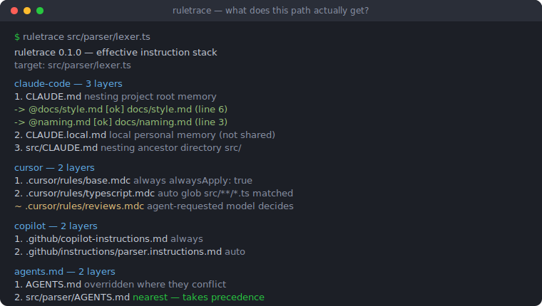

# ruletrace

[English](README.md) | [中文](README.zh.md) | [日本語](README.ja.md)

[](LICENSE)  [](CHANGELOG.md)  [](CONTRIBUTING.md)

**ruletrace：AI コーディングエージェントのルールファイルを読み取り専用で解決・デバッグするオープンソースツール — 任意のパスが実際に受け取る指示スタックを正確に表示：ネストした CLAUDE.md、@ インポート、Cursor glob、Copilot applyTo。**



```bash
git clone https://github.com/JaydenCJ/ruletrace.git && cd ruletrace && npm install && npm run build
node dist/cli.js --help   # or: npm link && ruletrace --help
```

> プレリリース：v0.1.0 はまだ npm に公開されていません。上記のとおりソースからインストールしてください。ランタイム依存ゼロ — devDependency は `typescript` のみです。

## なぜ ruletrace？

エージェントのルールファイルは、いつの間にかデバッガのない設定言語になりました。ひとつのリポジトリに、ルートの `CLAUDE.md`、サブディレクトリごとのネスト版、5 ホップ先まで展開する `@` インポート、個人用 `CLAUDE.local.md`、スコープ付き glob と 4 種のアタッチモードを持つ Cursor `.mdc` ルール、Copilot の `applyTo` 指示、最も近いファイルだけが勝つ `AGENTS.md` チェーンが同居し得ます — そして「エージェントが*この*ファイルを編集するとき、実際に何を見るのか？」という問いには、各ツールのローダーを頭の中で再現する以外の答えがありません。既存ツールは逆側の問題を攻めます：rulesync や Ruler のようなジェネレータはマスターコピーからルールファイルを*書き出す*もので、執筆は助けても解決のされ方は何も教えてくれず、手書き・同僚 3 人の手・去年の慣習で書かれたファイルにはまったく無力です。ruletrace は欠けていた読み取り側です：ネスト・インポート・スコープ・glob を各ツールとまったく同じ方式で解決し、各レイヤーが*なぜ*付いたかを示し、1 バイトも書かない、たった一つのコマンドです。

| | ruletrace | rulesync | Ruler | grep + 目視 |
| --- | --- | --- | --- | --- |
| 方向 | 読み取り専用：解決結果を説明 | ルールファイルの生成/変換 | マスターコピーから生成 | 読む、遅く |
| パス単位の回答（「src/a.ts に何が効く？」） | はい — 1 コマンド、ツール別 | いいえ | いいえ | 手動のツリー巡回 |
| `@` インポート展開（循環/深さ/欠落） | はい、行番号付きの完全ツリー | いいえ | いいえ | 手作業 |
| Cursor アタッチモード（always/auto/agent/manual） | ルールごとに分類、glob を実評価 | .mdc を書き出す | .mdc を書き出す | frontmatter を自分で読む |
| 壊れた参照の lint（`check`、exit 1） | はい — インポート、死んだ glob、frontmatter | 出力間のドリフト | 出力間のドリフト | なし |
| 正確に組み立てたコンテキスト（`--content`） | はい、由来バナー付き | いいえ | いいえ | cat、順序は運まかせ |
| ランタイム依存 | なし（Node 標準ライブラリ） | npm 依存ツリー | npm 依存ツリー | なし |

<sub>比較は 2026-07 時点の各上流ドキュメントに基づきます。rulesync と Ruler が解くのは執筆 — 多数のルール形式を単一ソースと同期させること。ruletrace が解くのは検査で、それらのツールが触れたことのないリポジトリでも機能します。</sub>

## 特徴

- **4 つのエコシステムをひとつのトレースに** — Claude Code（`CLAUDE.md`、`CLAUDE.local.md`）、Cursor（`.cursor/rules/*.mdc`、レガシー `.cursorrules`）、GitHub Copilot（`copilot-instructions.md`、`*.instructions.md`）、`AGENTS.md` を、各ツール自身のセマンティクスで解決して並べて表示。
- **本物のインポート解決** — `@path` インポートを文書化されたルールどおり再帰展開：コードブロックとインラインコードはスキップ、5 ホップ上限、循環は切断してラベル付け、`@~/` の個人インポートは `--home` で明示しない限り不透明のまま。
- **「何が」だけでなく「なぜ」** — すべてのレイヤーが理由を明示：`ancestor directory src/`、`glob src/**/*.ts matched`、`nearest AGENTS.md — takes precedence`、`model decides from description`。
- **組み立てられたコンテキストを逐語で** — `--content` はパスが実際に受け取る連結済み指示テキストを出力し、インポートを深さ優先でインライン化し、各断片に由来バナーを付けます。
- **ルール腐敗の linter** — `ruletrace check` は欠落・循環インポート、死んだ glob、壊れた frontmatter、非推奨形式を検出し、エラーで exit 1（`--strict` で警告も昇格）、`--json` でスクリプトに流せます。
- **What-if モード** — 対象パスは存在しなくて構いません：作る前に、計画中のファイルが何を受け取る*はず*かを聞けます。
- **読み取り専用・オフライン・依存ゼロ** — ruletrace はファイルを読むだけ。ネットワークなし、テレメトリなし、ランタイムパッケージなし、同一ツリーにはバイト単位で同一の出力。

## クイックスタート

深くネストしたファイルが実際に何を受け取るかを聞く（最初に一度 `bash examples/setup-demo.sh` を実行して gitignore 済みの Copilot fixture を生成してから、[`examples/demo-project`](examples/demo-project) 内で実行）：

```bash
ruletrace src/parser/lexer.ts
```

実際にキャプチャした出力：

```text
ruletrace 0.1.0 — effective instruction stack
root:   /work/demo-project
target: src/parser/lexer.ts

claude-code — 3 layers (read shallow to deep; deeper files are more specific and read later)
  1. CLAUDE.md        nesting          project root memory
       -> @docs/style.md  [ok]  docs/style.md (line 6)
          -> @naming.md  [ok]  docs/naming.md (line 3)
       -> @docs/release.md  [ok]  docs/release.md (line 7)
  2. CLAUDE.local.md  local            personal memory at project root (not shared)
  3. src/CLAUDE.md    nesting          ancestor directory src/

cursor — 2 layers (always + matching-glob rules are injected; agent-requested rules depend on the model)
  1. .cursor/rules/base.mdc        always           alwaysApply: true
  2. .cursor/rules/typescript.mdc  auto             glob src/**/*.ts matched
  ~  .cursor/rules/reviews.mdc     agent-requested  model decides from description

copilot — 2 layers (repository instructions first, then every matching .instructions.md)
  1. .github/copilot-instructions.md              always           applies to every request in this repository
  2. .github/instructions/parser.instructions.md  auto             applyTo src/parser/**/*.ts matched

agents.md — 2 layers (nearest file wins on conflicts; some agents read only the nearest one)
  1. AGENTS.md             nesting          ancestor AGENTS.md — overridden where they conflict
  2. src/parser/AGENTS.md  nesting          nearest AGENTS.md — takes precedence
```

続けてリポジトリ全体のルール腐敗を lint — 壊れたインポートは実行を失敗させます（`docs/naming.md` を削除した後の実出力）：

```text
note    local-memory            CLAUDE.local.md: CLAUDE.local.md is personal memory; collaborators do not see it
error   import-missing          docs/style.md:3: @naming.md does not resolve to a file
1 error, 0 warnings, 1 note
```

`ruletrace tree` は各ルールファイルを種別付きで列挙し、`--content` は各ツールが注入する組み立て済みテキストを出力します。3 コマンドとも `--json` に対応。

## コマンドとオプション

| コマンド / フラグ | デフォルト | 効果 |
| --- | --- | --- |
| `ruletrace <path>` | — | explain：どのルールファイルが `<path>` に効くか、ツール別に、なぜ |
| `ruletrace tree` | — | ルート以下で発見された全ルールファイルの一覧 |
| `ruletrace check` | — | 診断。エラーで exit 1、`--strict` で警告も昇格 |
| `--root <dir>` | 最寄りの `.git` 祖先、なければ cwd | 解決の基準となるプロジェクトルート |
| `--tool <list>` | `all` | `claude`、`cursor`、`copilot`、`agents` に限定（CSV、繰り返し可） |
| `--json` | オフ | 機械可読出力、`schema_version: 1` |
| `--content` | オフ | explain のみ：由来バナー付きの組み立て済み指示テキスト |
| `--home <dir>` | 未設定 | `@~/` インポートを不透明のままにせず `<dir>` 基準で解決 |

終了コード：`0` 正常、`1` check が問題を検出、`2` 使い方または I/O エラー。ツールごとの完全なセマンティクス — アタッチモード、スコープ、glob 方言、決定性の保証 — は [docs/resolution.md](docs/resolution.md) に規定しています。

## アーキテクチャ

```mermaid
flowchart LR
    CLI[cli<br/>argv, exit codes] --> DISC[discover<br/>one-pass walk]
    DISC --> FM[frontmatter<br/>mdc + applyTo]
    DISC --> T[tools/*<br/>claude · cursor · copilot · agents]
    T --> IMP[imports<br/>@-tree, cycles, depth]
    T --> GLOB[glob<br/>*, **, braces, classes]
    T --> TRACE[resolve<br/>Trace + content view]
    TRACE --> REP[report<br/>text · json]
    DISC --> CHK[check<br/>diagnostics]
    CHK --> REP
```

`explain`・`tree`・`check` はすべて同じ 1 パス走査のインベントリを消費します。リゾルバとマッチャは純関数なので、ファイルシステムに触れるのは 1 回の実行につき 1 度だけです。

## ロードマップ

- [x] v0.1.0 — Claude Code・Cursor・Copilot・AGENTS.md 横断の explain/tree/check；再帰 `@` インポートツリー；アタッチモード分類；`--content` 組み立て；`--json`；依存ゼロ；92 テスト + smoke スクリプト
- [ ] エコシステム追加：Windsurf `.windsurf/rules`、Cline `.clinerules`、Codex 設定
- [ ] `--why <rule-file>` — 問いの反転：このルールはどのパスに届くのか？
- [ ] Diff モード：2 つの git リビジョン間でスタックがどう変わるか
- [ ] 重複レポート：矛盾していそうなレイヤーの組
- [ ] 編集セッション向けの watch モード

全リストは [open issues](https://github.com/JaydenCJ/ruletrace/issues) を参照。

## コントリビュート

バグ報告・リゾルバの修正・PR を歓迎します — ローカルの手順は [CONTRIBUTING.md](CONTRIBUTING.md) を参照（`npm test` に加え `SMOKE OK` を表示する `scripts/smoke.sh`。本リポジトリは意図的に CI を持ちません）。入門タスクは [good first issue](https://github.com/JaydenCJ/ruletrace/issues?q=is%3Aissue+is%3Aopen+label%3A%22good+first+issue%22) ラベル、設計の議論は [Discussions](https://github.com/JaydenCJ/ruletrace/discussions) へ。

## ライセンス

[MIT](LICENSE)
